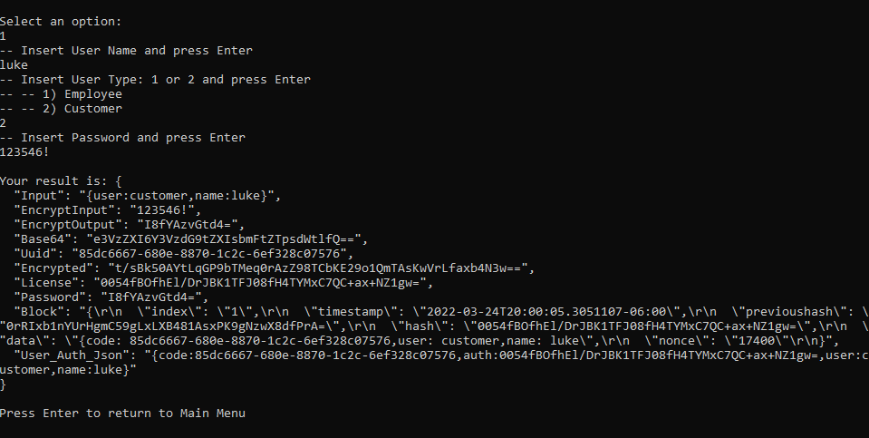

# ParcelService-license
Prototype that generates: uuid, base64, license, used as credential

## Overview

This is a solution to be able to generate credentials for an employee or client. 
The license number is based on the name, user type and password.

### Screenshot

## Built with

Visual Studio 2019.
Net 5.0

## Author

- Website - [Victor Cruz](https://github.com/ikreuz/)
